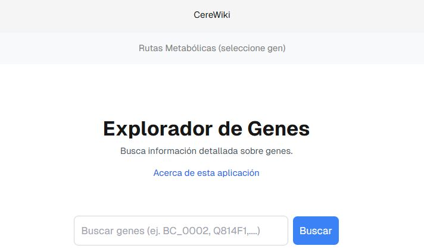

# TFG_app_subwiki

# Plataforma web para el estudio de microorganismos de interés (CereWiki)

CereWiki es una aplicación web intuitiva para la búsqueda de genes del microorganismo *Bacillus cereus*. Muestra información detallada de cada gen y las rutas metabólicas en las que participa.

## Tabla de Contenidos
* [Vista Previa](#%EF%B8%8F-vista-previa)
* [Tecnologías Utilizadas](#-tecnologías-utilizadas)
* [Prerrequisitos](#-prerrequisitos)
* [Instalación y Configuración](#️-instalación-y-configuración)
    * [Clonar el Repositorio](#1-clonar-el-repositorio)
    * [Configuración de MongoDB](#2-configuración-de-mongodb)
    * [Construcción con Docker Compose](#3-construcción-con-docker-compose)
* [Acceso a la Aplicación](#-acceso-a-la-aplicación)
* [Autoría](#-autoría)

## Vista Previa


 
(Próximamente)

## Tecnologías Utilizadas

*   **Frontend:**
    *   Next.js
    *   React
    *   npm
    *   TypeScript
    *   JavaScript
    *   CSS Modules
    *   Cytoscape.js
*   **Backend:**
    *   FastAPI
    *   Python
    *   Uvicorn
    *   Pydantic
*   **Base de Datos:**
    *   MongoDB
*   **Herramientas de Desarrollo:**
    *   VS Code
    *   Git
    *   GitHub
*   **Despliegue:**
    *   Docker
    *   Docker Compose

## Prerrequisitos

Para la instalción local, se debe tener instaladas las siguientes herramientas antes de continuar:

*   Python (versión 3.8.10 o superior)
*   pip (versión 20.0.2 o superior)
*   Node.js (versión v18.20.8 o superior)
*   npm (versión 10.8.2 o superior) o Yarn
*   Git (versión 2.25.1 o superior)
*   Docker Compose (versión v2.25.0 o superior)
*   MongoDB (MongoDB Compass instalado o una cuenta en MongoDB Atlas)

## Instalación y Configuración

Pasos para configurar el proyecto localmente:

### 1. Clonar el Repositorio

```bash
git clone https://github.com/SusanaCano/TFG_app_subwiki.git
cd tu_proyecto
```

### 2. MongoDB Atlas

*   Tener un usuario.
*   Crear una base de datos y una colección.
*   Permitir acceso a la IP.
*   Obtener la cadena de conexión.

### Crear archivo .env

```dotenv

# MongoDB Atlas 
# Reemplazar los siguientes valores por las credenciales propias.

    DATABASE_URL=mongodb+srv://<TU_USUARIO_ATLAS>:<TU_CONTRASEÑA_ATLAS>@<TU_CLUSTER_URL>/<NOMBRE_DE_TU_BD>?retryWrites=true&w=majority

```

### Construcción Docker Compose:

```
# Construir la imágenes de Docker:

docker compose build

# Inicializar los contenedores:

docker compose up -d

# Para detener los contenedores:

docker compose down

```

### Acceso a la aplicación:

*   Frontend (Next.js): Abrir el navegador web e ir: http://localhost:3000

*   Backend (FastAPI): Abrir el navegador web e ir: http://localhost:8000/docs

### Autoría:

--- 

Desarrollado por [Susana Cano] (https://github.com/SusanaCano).

Copyright (c) [2025].


